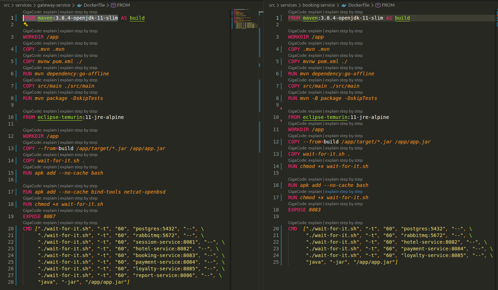
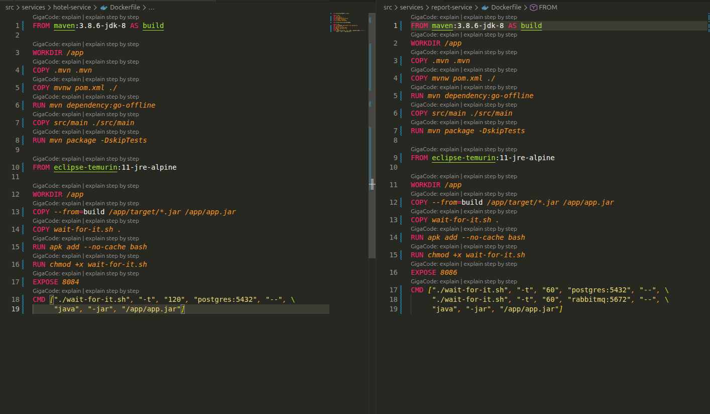
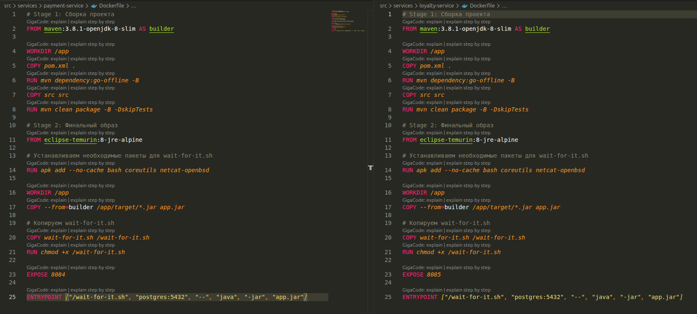
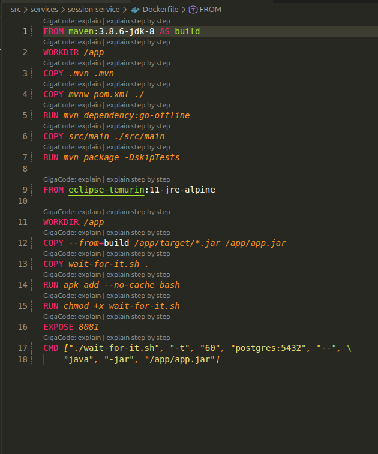

## Part 1. Запуск нескольких Docker-контейнеров с использованием Docker Compose

Стоит вспомнить, как работает Docker Compose! Давай сначала попробуем запустить микросервисное приложение из папки `src` таким образом, чтобы тесты постмана проходили успешно.

### Задание

1) Напиши Dockerfile для каждого отдельного микросервиса. Необходимые зависимости описаны в материалах. В отчете отобрази размер собранных образов любого сервиса различными способами.

Dockerfile для gateway-service и booking-service:


Dockerfile для hotel-service и report-service:


Dockerfile для loyalty-service и payment-service:


Dockerfile для Session-service:


Размер образов


2) Напиши Docker Compose файл, который осуществляет корректное взаимодействие сервисов. Пробрось порты для доступа к gateway service и session service из локальной машины. Помощь по Docker Compose ты найдешь в материалах.

Docker-compose 

```
services:

    rabbitmq:
      image: rabbitmq:3-management-alpine
      ports:
        - "15672:15672"
      expose:
        - "5672"
      environment:
        RABBITMQ_DEFAULT_USER: guest
        RABBITMQ_DEFAULT_PASS: guest
      healthcheck:
        test: [ "CMD", "rabbitmq-diagnostics", "check_running" ]
        interval: 10s
        timeout: 5s
        retries: 10
      networks:
      - app-network

    postgres:
        image: postgres:15-alpine
        container_name: postgres
        environment:
            POSTGRES_USER: postgres
            POSTGRES_PASSWORD: postgres
        expose:
          - "5432"
        volumes:
            - postgres-data:/var/lib/postgresql/data
            - ./database/init.sql:/docker-entrypoint-initdb.d/init.sql:ro
        healthcheck:
            test: ["CMD-SHELL", "pg_isready -U postgres -d users_db"]
            interval: 5s
            timeout: 5s
            retries: 10
            start_period: 10s
        networks:
            - app-network

    session-service:
        build: ./session-service/
        depends_on:
          - postgres
        environment:
          POSTGRES_HOST: postgres
          POSTGRES_PORT: 5432
          POSTGRES_USER: postgres
          POSTGRES_PASSWORD: postgres
          POSTGRES_DB: users_db
        ports:
          - "8081:8081"
        networks:
          - app-network

    report-service:
      build: ./report-service/
      depends_on:
        - postgres
      environment:
        POSTGRES_HOST: postgres
        POSTGRES_PORT: 5432
        POSTGRES_USER: postgres
        POSTGRES_PASSWORD: postgres
        POSTGRES_DB: statistics_db
        RABBIT_MQ_HOST: rabbitmq
        RABBIT_MQ_PORT: 5672
        RABBIT_MQ_USER: guest
        RABBIT_MQ_PASSWORD: guest
        RABBIT_MQ_QUEUE_NAME: messagequeue
        RABBIT_MQ_EXCHANGE: messagequeue-exchange
      expose:
        - "8086"
      networks:
        - app-network

    payment-service:
      build: ./payment-service/
      depends_on:
        - postgres
      environment:
        POSTGRES_HOST: postgres
        POSTGRES_PORT: 5432
        POSTGRES_USER: postgres
        POSTGRES_PASSWORD: postgres
        POSTGRES_DB: payments_db
      expose:
        - "8084"
      networks:
        - app-network

    loyalty-service:
      build: ./loyalty-service/
      depends_on:
        - postgres

      environment:
        POSTGRES_HOST: postgres
        POSTGRES_PORT: 5432
        POSTGRES_USER: postgres
        POSTGRES_PASSWORD: postgres
        POSTGRES_DB: balances_db
      expose:
        - "8085"
      networks:
        - app-network

    hotel-service:
      build: ./hotel-service/
      depends_on:
        - postgres
      environment:
        POSTGRES_HOST: postgres
        POSTGRES_PORT: 5432
        POSTGRES_USER: postgres
        POSTGRES_PASSWORD: postgres
        POSTGRES_DB: hotels_db
      expose:
        - "8082"
      networks:
        - app-network

    gateway-service:
      build: ./gateway-service/
      depends_on:
        - session-service
        - hotel-service
        - booking-service
        - loyalty-service
        - report-service
        - payment-service
      environment:
        SESSION_SERVICE_HOST: session-service
        SESSION_SERVICE_PORT: 8081
        HOTEL_SERVICE_HOST: hotel-service
        HOTEL_SERVICE_PORT: 8082
        BOOKING_SERVICE_HOST: booking-service
        BOOKING_SERVICE_PORT: 8083
        PAYMENT_SERVICE_HOST: payment-service
        PAYMENT_SERVICE_PORT: 8084
        LOYALTY_SERVICE_HOST: loyalty-service
        LOYALTY_SERVICE_PORT: 8085
        REPORT_SERVICE_HOST: report-service
        REPORT_SERVICE_PORT: 8086
      ports:
        - "8087:8087"
      networks:
        - app-network

    booking-service:
      build: ./booking-service/
      depends_on:
        - postgres
        - rabbitmq
        - hotel-service
        - payment-service
        - loyalty-service
      environment:
        POSTGRES_HOST: postgres
        POSTGRES_PORT: 5432
        POSTGRES_USER: postgres
        POSTGRES_PASSWORD: postgres
        POSTGRES_DB: reservations_db
        RABBIT_MQ_HOST: rabbitmq
        RABBIT_MQ_PORT: 5672
        RABBIT_MQ_USER: guest
        RABBIT_MQ_PASSWORD: guest
        RABBIT_MQ_QUEUE_NAME: messagequeue
        RABBIT_MQ_EXCHANGE: messagequeue-exchange
        HOTEL_SERVICE_HOST: hotel-service
        HOTEL_SERVICE_PORT: 8082
        PAYMENT_SERVICE_HOST: payment-service
        PAYMENT_SERVICE_PORT: 8084
        LOYALTY_SERVICE_HOST: loyalty-service
        LOYALTY_SERVICE_PORT: 8085
      expose:
        - "8083"
      networks:
        - app-network
volumes:
  db:
  postgres-data:

networks:
  app-network:
```
3) Собери и разверни веб-сервис с помощью написанного Docker Compose файла на локальной машине.

Все контейнеры успешно запущены


4) Прогони заготовленные тесты через postman и удостоверься, что все они проходят успешно. Инструкцию по запуску тестов можно найти в материалах. В отчете отобрази результаты тестирования.

Все тесты успешно пройдены


## Part 2. Создание виртуальных машин

Пришло время заготовить основу для будущих узлов кластера. Создадим виртуальную машину.

### Задание

1) Установи и инициализируй Vagrant в корне проекта. Напиши Vagrantfile для одной виртуальной машины. Перенеси исходный код веб-сервиса в рабочую директорию виртуальной машины.


2) Зайди через консоль внутрь виртуальной машины и удостоверься, что исходный код встал, куда нужно. Останови и уничтожь виртуальную машину.


Остановка и уничтожение ВМ


## Part 3. Создание простейшего Docker Swarm

Ну вот и пришло время создания твоего первого Docker Swarm!

### Задание

1) Модифицируй Vagrantfile для создания трех машин: manager01, worker01, worker02. Напиши shell-скрипты для установки Docker внутрь машин, инициализации и подключения к Docker Swarm. Помощь с Docker Swarm ты найдешь в материалах.


2) Загрузи собранные образы на Docker Hub и модифицируй Docker Compose файл для подгрузки расположенных на Docker Hub образов.


3) Подними виртуальные машины и перенеси на менеджер Docker Compose файл. Запусти стек сервисов, используя написанный Docker Compose файл.

4) Настрой прокси на базе nginx для доступа к gateway service и session service по оверлейной сети. Сами gateway service и session service сделай недоступными напрямую.


5) Прогони заготовленные тесты через Postman и удостоверься, что все они проходят успешно. В отчете отобрази результаты тестирования.

6) Используя команды Docker, отобрази в отчете распределение контейнеров по узлам.


7) Установи отдельным стеком Portainer внутри кластера. В отчете отобрази визуализацию распределения задач по узлам с помощью Portainer.


